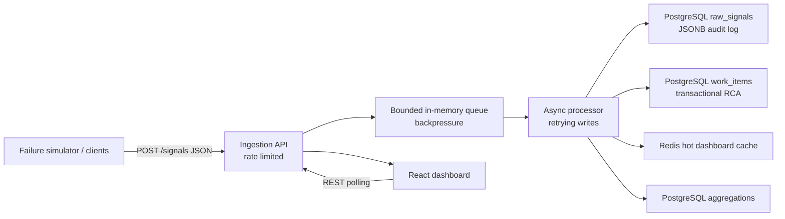

# Mission-Critical Incident Management System

This repository implements the Zeotap engineering challenge as a small but complete Incident Management System (IMS).

> Submission note: push this repository to GitHub, then add the final repository URL to the generated submission PDF before sending it.

## Architecture



## Tech Stack

- **Backend:** Python FastAPI service, `asyncio` worker queue, async PostgreSQL driver, Redis, `pytest`.
- **Frontend:** React dashboard served by Vite.
- **Storage model:**
  - PostgreSQL `raw_signals`: high-volume JSONB audit log.
  - PostgreSQL `work_items`: transactional source of truth for incidents and RCA records.
  - Redis: rate limiting, debounce state, and hot dashboard cache.
  - PostgreSQL `aggregations`: timeseries counters.
- **Containerization:** Docker Compose for backend, frontend, PostgreSQL, and Redis.

Production equivalents would add Kafka/NATS for ingestion buffering and ClickHouse/S3 for long-term raw signal analytics, while keeping PostgreSQL for transactional incident state and Redis for hot-path cache/rate limiting.

## Repository Structure

```text
backend/                  IMS backend engine and tests
frontend/                 React incident dashboard
samples/                  Mock failure events and simulator
docs/API.md               API examples and payloads
docs/BACKEND.md           Backend architecture and internals
docs/FRONTEND.md          Frontend usage and workflow
docs/MCP_HOST_MONITORING.md
docs/TESTING.md           Test and verification guide
docs/REQUIREMENTS_TRACEABILITY.md
docs/ASSIGNMENT_PLAN.md   Prompt/spec/plan record
```

## Backpressure Handling

The ingestion API never writes directly to durable storage. Incoming signals are accepted into a bounded in-memory queue and processed asynchronously by a worker. This prevents slow persistence from crashing the API path.

Backpressure controls:

- Per-IP token-bucket rate limiter on `POST /signals`.
- Bounded queue with a `503` response when the processor is saturated.
- Batch ingestion support so high-throughput clients can send arrays.
- Retry logic with exponential backoff around persistence writes.
- Debouncing window: 100 signals for the same component within 10 seconds create one work item, while all raw signals remain linked to that incident.

## Non-Functional Work and Bonus Points

- Optional API-key security for mutating APIs using `INGEST_API_KEY` and `X-IMS-API-Key`.
- Request body size limit through `MAX_BODY_BYTES`.
- CORS origin configuration through `CORS_ORIGIN`.
- Security headers: `X-Content-Type-Options`, `Referrer-Policy`, and `Cache-Control`.
- Retry logic for persistence writes.
- Mutex-protected source-of-truth updates to avoid race conditions.
- Console throughput metrics every 5 seconds.

## Setup

```bash
docker compose up --build
```

Services:

- Backend: [http://localhost:4000](http://localhost:4000)
- Frontend: [http://localhost:5173](http://localhost:5173)

Local backend without Docker requires local PostgreSQL and Redis:

```bash
cd backend
python -m venv .venv
.venv\Scripts\activate
pip install -r requirements.txt
uvicorn app.main:app --host 0.0.0.0 --port 4000
```

Local frontend without Docker:

```bash
cd frontend
npm install
npm run dev
```

## Useful Commands

Run backend tests:

```bash
cd backend
python -m pytest tests
```

Simulate an RDBMS outage followed by MCP host failures:

```bash
python samples/simulate_failure.py
```

## Documentation

- [Backend Guide](docs/BACKEND.md)
- [API Guide](docs/API.md)
- [Frontend Guide](docs/FRONTEND.md)
- [MCP Host Monitoring Guide](docs/MCP_HOST_MONITORING.md)
- [Testing Guide](docs/TESTING.md)
- [Requirements Traceability](docs/REQUIREMENTS_TRACEABILITY.md)
- [GitHub Submission Guide](docs/GITHUB_SUBMISSION.md)

## API Summary

- `GET /health` - service health and queue depth.
- `POST /signals` - ingest one signal or an array of signals.
- `GET /incidents` - live dashboard state sorted by severity.
- `GET /incidents/:id` - incident detail with linked raw signals.
- `PATCH /incidents/:id/status` - transition state.
- `POST /incidents/:id/rca` - submit RCA and calculate MTTR.
- `GET /aggregations` - timeseries buckets.

## RCA Rule

Closing an incident is rejected unless the RCA contains:

- `startTime`
- `endTime`
- `rootCauseCategory`
- `fixApplied`
- `preventionSteps`

MTTR is calculated from RCA `startTime` to `endTime` when the RCA is submitted.

## Creative Additions

- Strategy pattern for component-specific alert severity.
- State pattern for lifecycle transitions.
- Console throughput metrics every 5 seconds.
- PostgreSQL and Redis are included in Docker Compose so the assignment uses real infrastructure components.
- Optional API key, body-size guard, configurable CORS, and security headers.
