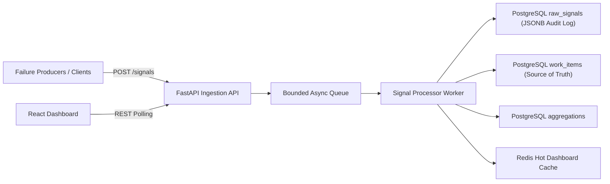

# Mission-Critical Incident Management System

A production-inspired full-stack Incident Management System (IMS) built for the Zeotap Infrastructure / SRE Engineering Challenge.

This system ingests high-volume infrastructure failure signals, debounces repeated failures into incidents, enforces RCA-driven workflow transitions, calculates MTTR, and exposes a live operational dashboard.

---

## Clone and Run

### 1. Clone Repository

```bash
git clone https://github.com/Chitransh1011/zeotap-incident-management-system.git
cd zeotap-incident-management-system
```

### 2. Start Full Stack with Docker

```bash
docker compose up --build
```

### 3. Access Services

- **Frontend Dashboard:** http://localhost:5173
- **Backend API:** http://localhost:4000
- **Health Check:** http://localhost:4000/health

### 4. Generate Sample Failure Events

```bash
python samples/simulate_failure.py
```

This simulates:

- RDBMS outage (`P0`)
- MCP Host dependency failure (`P1`)
- Cache degradation (`P2`)

---

## Architecture Diagram



---

## Tech Stack

### Backend
- Python FastAPI
- asyncio worker queue
- asyncpg
- Redis
- pytest

### Frontend
- React + Vite

### Infrastructure
- Docker Compose
- PostgreSQL
- Redis

---

## Repository Structure

```text
backend/                 FastAPI backend service
frontend/                React dashboard UI
samples/                 Failure simulation scripts and JSON payloads
docs/                    Architecture, API, testing, design docs
docker-compose.yml       Local orchestration
README.md                Project overview and setup guide
```

---

## Key Features

### Async Signal Ingestion
- Non-blocking ingestion pipeline
- Bounded queue buffering

### Backpressure Handling
- Queue saturation returns `503`
- Rate limiting returns `429`

### Debouncing Logic
- Signals for same component within 10s create one incident
- All raw signals linked to the same work item

### RCA-Enforced Workflow
- Incident cannot move to `CLOSED` without complete RCA

### MTTR Calculation
- Automatically computed from RCA start/end times

### Live Dashboard
- Active incidents sorted by severity
- Raw signal drill-down
- RCA submission UI

---

## Backpressure Design

The ingestion API never writes directly to durable storage.

Flow:

```text
Signal → Queue → Worker → Persistence
```

Controls:

- Per-IP Redis rate limiter
- Bounded async queue
- Immediate `503 Queue Saturated` on overload
- Retry logic around persistence writes

---

## Persistence Model

| Layer | Technology | Purpose |
|-------|------------|---------|
| Raw Signal Audit Log | PostgreSQL JSONB | Store every raw signal |
| Source of Truth | PostgreSQL | Work Items + RCA |
| Hot Cache | Redis | Dashboard state / Debounce / Rate Limit |
| Aggregations | PostgreSQL | Timeseries counters |

---

## API Summary

| Endpoint | Purpose |
|---------|---------|
| `GET /health` | Health + queue depth |
| `POST /signals` | Ingest single/batch signals |
| `GET /incidents` | List active incidents |
| `GET /incidents/:id` | Incident detail |
| `PATCH /incidents/:id/status` | Transition incident state |
| `POST /incidents/:id/rca` | Submit RCA |
| `GET /aggregations` | Read timeseries metrics |

---

## Testing

### Backend Tests

```bash
cd backend
python -m pytest tests -v
```

### Frontend Build Test

```bash
cd frontend
npm install
npm run build
```

---

## Documentation

- `docs/architecture.md`
- `docs/design-decisions.md`
- `docs/api.md`
- `docs/testing.md`
- `docs/prompts-and-plans.md`

---

## Design Patterns Used

### Strategy Pattern
Used for component-specific alert routing/severity.

### State Pattern
Used for incident lifecycle validation.

---

## Concurrency / Safety

- Atomic Redis debounce via `SET NX`
- PostgreSQL row-level locking via `SELECT ... FOR UPDATE`
- Worker exception resilience
- Retry logic with exponential backoff

---

## Creative / Bonus Additions

- Batch signal ingestion
- Optional API key authentication
- Request body size limits
- Security headers
- Configurable CORS
- Throughput metrics every 5 seconds
- Dependency-aware MCP host modeling

---

## Production Scaling Notes

Production evolution would replace:

| Current | Production Equivalent |
|---------|----------------------|
| asyncio Queue | Kafka / NATS / RabbitMQ |
| PostgreSQL JSONB Raw Signals | MongoDB / Cassandra / S3 / ClickHouse |
| Polling Dashboard | WebSockets / SSE |

---

## Author

**Chitransh Prasanna**  
Infrastructure / SRE Intern Assignment Submission
