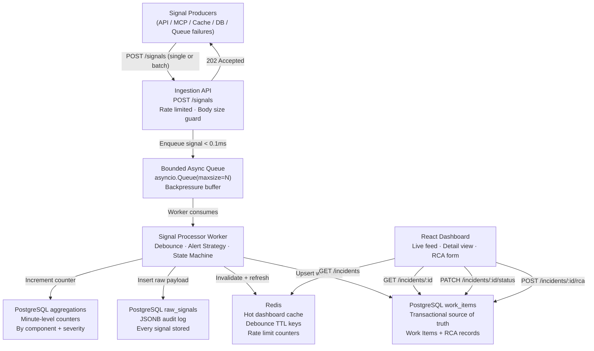

# Architecture Overview

## High-Level System Design



---

## Component Responsibilities

### Ingestion API (FastAPI)

- Accepts single signals (`{}`) or batches (`[{}, {}]`) at `POST /signals`.
- Validates schema via Pydantic — rejects malformed payloads with `422`.
- Checks per-IP rate limit counter in Redis — returns `429` if exceeded.
- Enqueues valid signals into the bounded `asyncio.Queue` — returns `202 Accepted`.
- Returns `503 Queue Saturated` if queue is at capacity.
- All other read endpoints (`GET /incidents`, `GET /health`) bypass the queue and serve directly.

### Bounded Async Queue

- `asyncio.Queue` with configurable `maxsize` (default: 10,000).
- Acts as the backpressure buffer between HTTP ingestion and slower persistence.
- `queueDepth` is exposed via `GET /health` for operational monitoring.
- Prevents the API worker threads from blocking on database I/O.

### Signal Processor Worker

A background `asyncio` coroutine that consumes from the queue continuously.

Processing pipeline per signal:

```
1. Check Redis debounce key for componentId
      ├── Key absent  → Create new Work Item (PostgreSQL)
      │                  Set Redis debounce key (TTL = 10s)
      │                  Determine alert priority via Strategy Pattern
      │                  Fire alert
      └── Key present → Retrieve existing Work Item ID from Redis

2. Insert raw signal into raw_signals (JSONB)
   Link to Work Item ID

3. Increment aggregation counter
   (component + severity + minute bucket)

4. Refresh dashboard cache in Redis
```

Resilience: exceptions in the worker are caught and logged; the worker loop continues so a single bad payload cannot halt processing.

### PostgreSQL — raw_signals

| Column | Type | Purpose |
|---|---|---|
| `id` | UUID | Primary key |
| `work_item_id` | UUID FK | Link to parent incident |
| `component_id` | TEXT | Source component |
| `component_type` | TEXT | RDBMS / CACHE / API etc. |
| `message` | TEXT | Error message |
| `severity` | TEXT | ERROR / WARN / INFO |
| `payload` | JSONB | Arbitrary extra data |
| `received_at` | TIMESTAMPTZ | Ingestion timestamp |

Queried when the frontend loads an incident detail view to show all linked raw signals.

### PostgreSQL — work_items

| Column | Type | Purpose |
|---|---|---|
| `id` | UUID | Primary key |
| `component_id` | TEXT | Affected component |
| `component_type` | TEXT | Determines alert priority |
| `status` | TEXT | OPEN / INVESTIGATING / RESOLVED / CLOSED |
| `priority` | TEXT | P0 / P1 / P2 |
| `signal_count` | INT | Running count of linked signals |
| `rca` | JSONB | RCA object (null until submitted) |
| `mttr_minutes` | FLOAT | Calculated on RCA submission |
| `created_at` | TIMESTAMPTZ | Timestamp of first signal |
| `updated_at` | TIMESTAMPTZ | Last transition timestamp |

All transitions are wrapped in a database transaction. The `CLOSED` transition additionally validates that the `rca` JSONB contains all five required fields before committing.

### PostgreSQL — aggregations

| Column | Type | Purpose |
|---|---|---|
| `bucket` | TIMESTAMPTZ | Minute-truncated timestamp |
| `component_id` | TEXT | Source component |
| `severity` | TEXT | ERROR / WARN / INFO |
| `count` | INT | Signal count in this bucket |

Upserted via `INSERT ... ON CONFLICT DO UPDATE SET count = count + 1` for atomic increments. Exposed via `GET /aggregations`.

### Redis

| Key Pattern | Type | Purpose |
|---|---|---|
| `ratelimit:{ip}` | STRING (int) | Token bucket counter, 1-minute TTL |
| `debounce:{componentId}` | STRING (work_item_id) | Debounce window, 10-second TTL |
| `dashboard:incidents` | STRING (JSON) | Serialised incident list, refreshed on every write |

### React Dashboard

Three views:
1. **Live Feed** — polls `GET /incidents` every 5 seconds, sorted by priority.
2. **Incident Detail** — loads on row click, fetches `GET /incidents/:id` for raw signals and current status.
3. **RCA Form** — appears when status is `RESOLVED`, submits `POST /incidents/:id/rca`.

Status transitions are triggered by buttons in the detail view calling `PATCH /incidents/:id/status`.

---

## Low-Level Design: Key Patterns

### State Pattern — Work Item Lifecycle

```
         ┌─────────────────────────────────────────┐
         │           WorkItemStateMachine           │
         │  current_state: WorkItemState            │
         │  transition(new_status) → validates +    │
         │  delegates to current state              │
         └──────────────────┬──────────────────────┘
                            │ implements
         ┌──────────────────┼──────────────────────┐
         ▼                  ▼                       ▼
   OpenState     InvestigatingState    ResolvedState    ClosedState
   allowed_next: allowed_next:         allowed_next:    allowed_next:
   [INVESTIGATING] [RESOLVED]          [CLOSED]         []
                                       validate_rca()
```

Each state class:
- Declares which statuses it can transition to (`allowed_transitions`).
- Implements any pre-condition checks (e.g. `ResolvedState.to_closed()` validates RCA completeness).
- Raises `InvalidTransitionError` for disallowed moves.

The machine is stored as in-process state and persisted to PostgreSQL on each valid transition within a transaction.

### Strategy Pattern — Alert Severity

```
         ┌────────────────────────────────────┐
         │          AlertStrategy (ABC)        │
         │  alert(work_item: WorkItem) → None  │
         └──────────────────┬─────────────────┘
                            │ concrete implementations
         ┌──────────────────┼──────────────┬──────────────┐
         ▼                  ▼              ▼              ▼
  RdbmsAlertStrategy  CacheAlertStrategy  ApiAlertStrategy  McpAlertStrategy
  priority = P0       priority = P2       priority = P1     priority = P1
  channel = pagerduty channel = slack     channel = slack   channel = pagerduty
```

The `AlertStrategyFactory.get(component_type)` returns the correct strategy. The processor calls `strategy.alert(work_item)` without knowing the concrete type.

---

## Backpressure Flow

```
Normal load (< queue capacity):
  Signal → Queue → Worker → DB   (all async, no blocking)

Burst load (queue filling):
  Signal → Queue → Worker tries to keep up
  Health endpoint shows increasing queueDepth

Queue full (sustained overload):
  Signal → API returns 503 immediately
  Client receives backpressure signal and can retry with backoff

DB slow / unavailable:
  Worker retries with exponential backoff
  Queue continues to absorb new signals during retry window
  API remains responsive throughout
```

---

## Data Flow: Debounce Window

```
t=0s  Signal(CACHE_CLUSTER_01) arrives
      Redis GET debounce:CACHE_CLUSTER_01 → nil
      → Create WorkItem WI-001, priority P2
      → Redis SET debounce:CACHE_CLUSTER_01 = WI-001 EX 10
      → Insert raw_signal linked to WI-001

t=2s  Signal(CACHE_CLUSTER_01) arrives (same component)
      Redis GET debounce:CACHE_CLUSTER_01 → WI-001
      → No new WorkItem created
      → Insert raw_signal linked to WI-001

... (signals 3–100 all link to WI-001)

t=10s Redis TTL expires
      Next signal for CACHE_CLUSTER_01 → new WorkItem WI-002
```

---

## MTTR Calculation

MTTR is calculated at RCA submission time:

```python
mttr_minutes = (rca.end_time - rca.start_time).total_seconds() / 60
```

`start_time` = time of first signal (operator-confirmed in RCA form, defaults to `work_item.created_at`).
`end_time` = time fix was confirmed applied.

This is stored on the `work_items` row and returned in all incident detail responses.